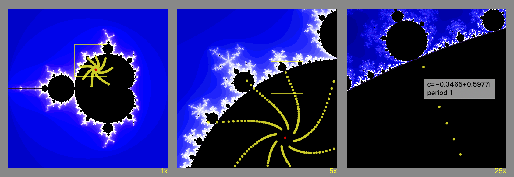

Interactive Mandelbrot Explorer
===============================

[Javascript Mandelbrot explorer.](https://mandelbrot.page/)
Click to zoom.
Click yellow zoom number to enlarge.

[The page](http://davidbau.com/mandelbrot/)
shows more fractal detail over time by refining
iterations infinitely as you explore.

Yellow dots show orbits. Red dots show limit cycles.
The popup shows details at a point.

Written by David Bau as a Javascript example in 2009; updated in 2020
to handle high device pixel ratios, show orbits, and calculate
periodicity. Updated again in 2024 to add double-double quad precision.

URL parameter options: use `?grid=3` to select 3-column view,
                   `c=-0.14-0.65ii` to set center,
               and `s=0.5` to set viewed size.

Implementation notes.  To minimize computation, the code identifies both
points that diverge and points that converge.  The algorithm can
identiify convergence to periodic cylces of arbitrarily long length.
Does a sparse computation, iterating only points that have not yet
diverged or converged to a cycle, and continues computation to an
infinite number of iterations to render crisp fractals over time.

[David Bau](http://davidbau.com/archives/2009/09/27/mandelbrot.html)
